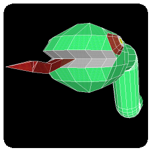

=========
SnakeByte
=========

    :SnakeByte: A snake pacman game for entertainment.
  
    :Writing by: Eddie Brüggemann
  
    :Language: python 2.7.3
  
    :Writing start: 17/09/13
  
    :Writing end: 22/10/13
  
    :Revision: 08/12/2014
  
    :Contact: mrcyberfighter@gmail.com
  
    :Credits: Thank's to my beloved mother, my family and to the doctors.

Description
===========

    **SnakeByte** is an game where you be an little snake who have to eat all apples

    to open the exit from the labyrinth where are phantoms, apples and walls.

    After hitting Enter after the start animation,

    you can choice the level you want to play or hit Space to sea the highscores

    from this level. You can choice the level by clicking on the arrows Next or Prev

    or by hitting the left and right arrows.

  
    After a little timer where the snake, in color green or red in case of the

    level you play, will blink to localize it in the labyrinth, the snake goes

    continously forward and you can control it with:
  
      For **AZERTY** keyboards:
  
        *  The **left arrow** to turn left.
    
        *  The **right arrow** to turn right.
    
        *  The **'q'** key to slide to your left.
    
        *  The **'d'** key to slide to your right.
    
        *  The **'z'** key to stop the snake going forward, by rehitting **'z'** the snake move forward again.

      For **QWERTY** keyboards:
  
        *  The **left arrow** to turn left.
    
        *  The **right arrow** to turn right.
    
        *  The **'a'** key to slide to your left.
    
        *  The **'d'** key to slide to your right.
    
        *  The **'w'** key to stop the snake going forward, by rehitting **'w'** the snake move forward again.
  
  
    At the end of an level the game will ask you if you want to register your

    score: the number of eated apples.

    Per default No is selected but you can switch with the right and left arrows.

    If you choice to register your score you must enter your name with the

    arrows:

          *  **Up** to change the current letter from your name.
        
          *  **Down** to change the current letter from your name.
        
          *  **Right** to confirm the current letter and go to the next letter.
        
          *  **Left** to erase the current letter.

    Finally hit Enter to register your score.
  
  
    You can quit every screen by hitting the escape key.

    Enjoy to play  **SnakeByte** who is not an easy game, wenn you can perfect

    control the snake, the game will give you pleasure and entertainment.

Installation
------------

    Run the installation script called install.sh as root.
  
    ..
  
        $ su root

        password:

        # . install.sh

    **SnakeByte** is now correctly installed and you can remove the extracted folder.

    If you want to remove  **SnakeByte** from your system.

    Run the desintallation script: unsinstall.sh as root.
  
    ..
  
        $ su root

        password:

        $ . unsinstall.sh

    **SnakeByte** is now completely removed from you system.

Copyright
---------

+--------------------------------------------------------------------------+
| This programm is under copyright from the GPL GNU GENERAL PUBLIC LICENSE |
+--------------------------------------------------------------------------+

    **SnakeByte** A snake pacman game for entertainment.

    Copyright (C) 2014 Bruggemann Eddie
  

    This file is part of **SnakeByte**.

    **SnakeByte** is free software: you can redistribute it and/or modify

    it under the terms of the GNU General Public License as published by

    the Free Software Foundation, either version 3 of the License, or

    (at your option) any later version.

    **SnakeByte** is distributed in the hope that it will be useful,

    but WITHOUT ANY WARRANTY; without even the implied warranty of

    MERCHANTABILITY or FITNESS FOR A PARTICULAR PURPOSE. See the

    GNU General Public License for more details.

    You should have received a copy of the GNU General Public License

    along with **SnakeByte**. If not, see <http://www.gnu.org/licenses/>

